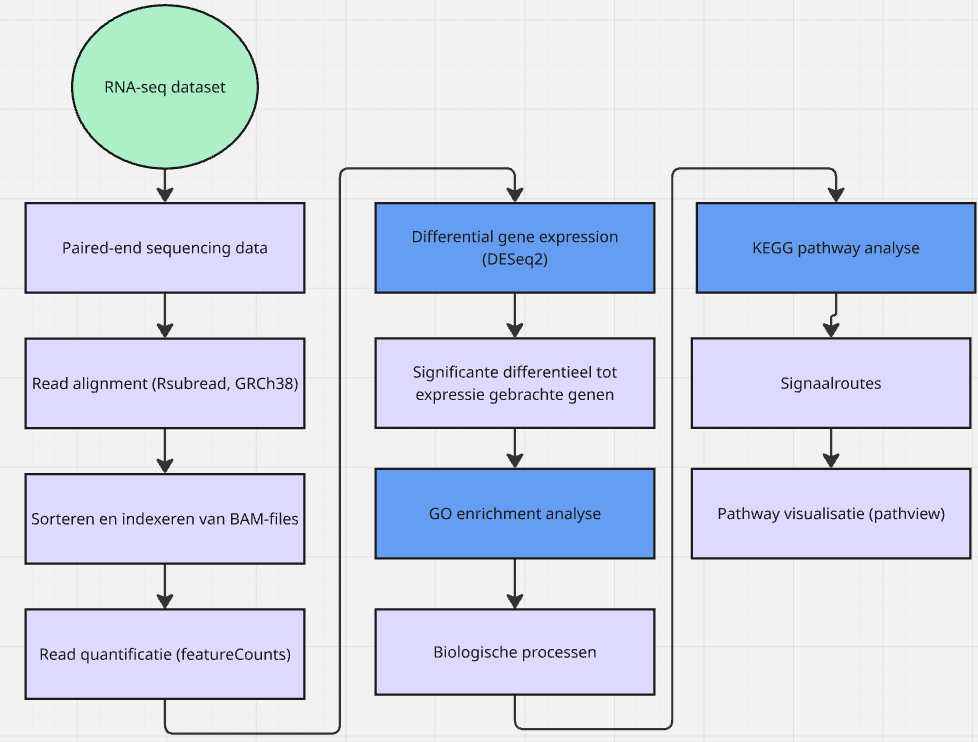

# Transcriptomische analyse van differentiële genexpressie en biologische signaalroutes bij reumatoïde artritis met behulp van RNA-sequencing

## Inleiding/aanleiding
Reumatoïde artritis (RA) is een veelvoorkomende chronische auto-immuunziekte die wordt gekenmerkt door ontstekingen van de gewrichten. De ziekte veroorzaakt pijn, stijfheid en verminderde mobiliteit, waardoor de kwaliteit van leven aanzienlijk kan afnemen. Ondanks de beschikbaarheid van ontstekingsremmende behandelingen is RA niet te genezen en reageert niet iedere patiënt hetzelfde op therapieën. Meer inzicht in de moleculaire mechanismen achter RA kan bijdragen aan een beter begrip van de ziekte en de ontwikkeling van nieuwe behandelingen.
Bij RA valt het immuunsysteem het gewrichtsslijmvlies aan, waardoor een chronische ontstekingsreactie ontstaat. Hierbij worden verschillende immuuncellen geactiveerd die ontstekingsbevorderende cytokinen, zoals TNF-α, IL-6, IL-1β en IL-17, produceren (Brennan & McInnes, 2008). Langdurige ontsteking kan leiden tot beschadiging van kraakbeen en bot (Bustamante et al., 2017). Hoewel genetische aanleg en omgevingsfactoren, zoals roken, een belangrijke rol spelen, is de exacte oorzaak van RA nog niet volledig bekend.
Bij RA verandert het patroon van genexpressie ten opzichte van gezonde individuen (Carr et al., 2020). In dit onderzoek werden daarom de verschillen in genexpressie tussen RA-patiënten en gezonde controles onderzocht met behulp van RNA-sequencing, gevolgd door differentiële genexpressieanalyse (DESeq2) en functionele GO- en KEGG-analyses om betrokken genen en biologische signaalroutes te identificeren. 

## Methode
Voor deze studie werd gebruik gemaakt van een RNA-sequencing [dataset](script/data/ruwe_data) afkomstig van synoviumbiopten van vier patiënten met RA en vier gezonde controles. De RNA-seq data bestond uit paired-end reads. deze werden geanalyseerd met behulp van de programmeertaal R. De ruwe sequencing reads werden gemapt op het Humane genoom: GCF_000001405.40_GRCh38.p14 met behulp van de Rsubread package [mapping](script/mapping). Vervolgens werden de gemapte reads gesorteerd en geïndexeerd en werd met featureCounts het aantal reads per gen bepaald [sorteren en indexeren](script/sorteren). De gemaakte [countmatrix](script/countmatrix) werd gebruikt als input voor een differentiële genexpressieanalyse met behulp van de [DESeq2](script/DESeq2) package. Hierbij werd de genexpressie tussen RA-patiënten en gezonde controles vergeleken en werden genen met een significante verandering in expressie geïdentificeerd.
Om de biologische betekenis van de differentieel tot expressie gebrachte genen te onderzoeken, werd een [GO enrichment analyse](script/GO_analyse) uitgevoerd om de betrokken biologische processen te identificeren. Daarna werd een [KEGG pathway analyse](script/KEGG) uitgevoerd om de metabole en signaalroutes in kaart te brengen. De resultaten van de KEGG-analyse werden verder gevisualiseerd met behulp van pathview, waarbij veranderingen in genexpressie werden geprojecteerd op relevante pathways. in de flowchart staan alle stappen overzichtelijk weergegeven in de volgorde waarin alles is uitgevoerd in Rstudio. Zie het volledige [script](/script/volledige_script) hier.

## Resultaten
Om genen te identificeren die verschillen in expressie tussen reumatoïde artritis (RA) patiënten en gezonde controles, werd een differentiële genexpressieanalyse met [DESeq2](tabellen/DESeq2_resultaten.csv) uitgevoerd op RNA-sequencingdata van vier RA-patiënten en vier gezonde controles. In totaal werden 25.579 genen geanalyseerd. Hiervan waren 3.275 genen significant verhoogd en 3.170 genen significant verlaagd in RA ten opzichte van de controlegroep (aangepaste p-waarde < 0,5). De [10 meest significant differentieel geëxprimeerde genen](tabellen/tabel1_top10_DE_genen.csv) tussen RA en gezonde controles werden gerangschikt op aangepaste p-waarde. De verschillen in genexpressie werden gevisualiseerd met behulp van een [volcano plot](figuren/figuren/1volcano_plot.png.md). Om de interpretatie van de volcano plot te ondersteunen, zijn CXCL8, MMP9, CCL2 en BAX geselecteerd voor afzonderlijke labeling op basis van hun biologische relevantie binnen ontstekings en ziekteprocessen die geassocieerd zijn met RA.

Verschillende ontstekingsgerelateerde genen waren verhoogd tot expressie in de RA-groep, waaronder CXCL8 (log2FC = 8,90; padj = 2,35 × 10⁻¹¹), MMP9 (log2FC = 4,12; padj = 5,24 × 10⁻⁵) en CCL2 (log2FC = 1,72; padj = 0,033). Deze genen zijn betrokken bij de activatie van immuuncellen en de afbraak van gewrichtsweefsel.

Er werd een KEGG-enrichmentanalyse uitgevoerd om te bepalen welke biologische signaal- en metabole pathways verrijkt waren in de differentieel geëxprimeerde genen. De resultaten toonden onder andere verrijking van de [TNF](figuren/figuren/pathway_TNF_signaling.png.md), T-celreceptor-, NF-κB- en [IL-17-signaalroutes](figuren/figuren/1IL_17_signaling_pathway.md). De top 10 verrijkte pathways zijn weergegeven in de [KEGG-dotplot](figuren/figuren/1KEGGdotplot.png.md)
Om de betrokken biologische processen van de differentieel geëxprimeerde genen te identificeren, werd een [Gene Ontology](figuren/figuren/1dotplot_GO_analyse.png.md) analyse uitgevoerd. Hierbij werd een sterke verrijking gevonden van processen die betrokken zijn bij de adaptieve en aangeboren immuunrespons, waaronder B-cel gemedieerde immuniteit, immunoglobuline-gemedieerde immuunrespons, lymfocytactivatie en NF-κB-signaaltransductie. Daarnaast werden processen zoals lymfocytdifferentiatie en antigeenreceptor-gemedieerde signalering significant verrijkt, wat wijst op een verhoogde activatie van immuuncellen bij RA.

Deze resultaten tonen aan dat het transcriptieprofiel van RA-synovium sterk wordt gekenmerkt door activatie van ontstekings- en immuunprocessen en bevestigen de belangrijke rol van ontstekingsgerelateerde signaalroutes bij de pathogenese van reumatoïde artritis.

## Conclusie
In dit transcriptomics onderzoek werd de genexpressie van synoviumbiopten van vier patiënten met reumatoïde artritis (RA) vergeleken met vier gezonde controles. Met behulp van RNA-sequencing, differentiële genexpressieanalyse en enrichmentanalyses werd onderzocht welke veranderingen in genexpressie en biologische processen geassocieerd waren met RA.

De DESeq2-analyse liet zien dat er verschillen in genexpressie aanwezig waren tussen de RA-groep en de gezonde controles. De verdere enrichmentanalyses lieten zien dat de differentieel geëxprimeerde genen betrokken waren bij verschillende biologische processen en signaalroutes. In de KEGG-analyse werden onder andere de TNF-, T-celreceptor-, NF-κB- en IL-17-signaalroutes verrijkt gevonden. Deze pathways zijn betrokken bij immuunactivatie en ontstekingsprocessen en sluiten daarmee aan bij de ontstekingsgerelateerde kenmerken van RA. De GO-analyse gaf daarnaast inzicht in de biologische processen waarin de differentieel geëxprimeerde genen betrokken zijn.

Op basis van deze resultaten kan worden geconcludeerd dat de gevonden verschillen in genexpressie vooral wijzen op veranderingen in immuun- en ontstekingsgerelateerde processen bij RA. Hiermee wordt de onderzoeksvraag beantwoord, waarbij de resultaten laten zien dat meerdere biologische processen en signaalroutes betrokken zijn bij de verschillen tussen RA-patiënten en gezonde controles.

Een belangrijke beperking van dit onderzoek is het kleine aantal monsters en het gebruik van een subset van de beschikbare sequencing reads. Hierdoor kunnen de resultaten niet direct worden gegeneraliseerd naar alle RA-patiënten. Vervolgonderzoek met een grotere patiëntengroep en volledige sequencingdatasets kan helpen om de gevonden verschillen verder te bevestigen en mogelijk relevante biomarkers voor RA te identificeren.

# algemene informatie github:

zie hier de [bronnen](/bronnen) met AI disclaimer

zie hier de [data stewardship](competenties/data_stewardship.md)

zie hier de 
