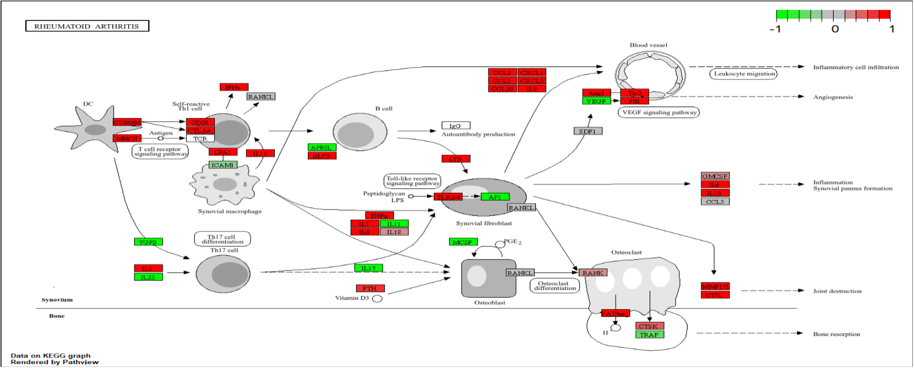

KEGG-enrichmentanalyse van differentieel geëxprimeerde genen tussen RA-patiënten en gezonde controles. De weergegeven pathways behoren tot de 10 meest verrijkte KEGG-pathways. De x-as geeft de GeneRatio weer, de grootte van de cirkel het aantal genen (Count) en de kleur de aangepaste p-waarde (p.adjust).
