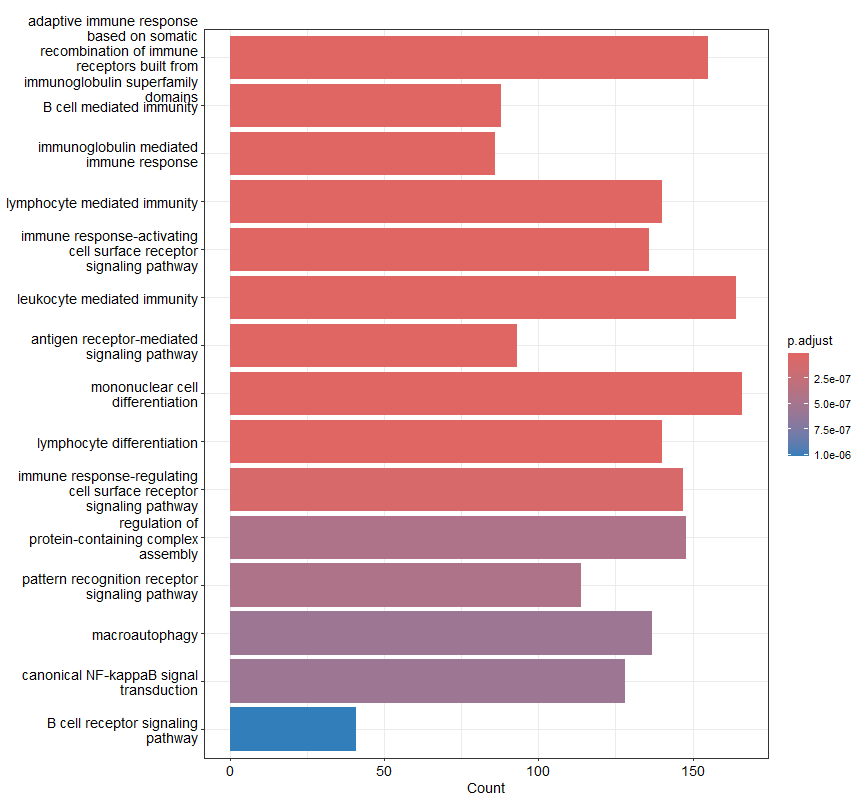

De Gene Ontology (GO) Biological Process barplot toont de vijftien meest significant verrijkte biologische processen onder de differentieel geëxprimeerde genen tussen RA-patiënten en gezonde controles. De lengte van de balken geeft het aantal genen weer dat betrokken is bij elk biologisch proces (Count), terwijl de kleur de statistische significantie (aangepaste p-waarde) weergeeft. De meest verrijkte processen waren gerelateerd aan de adaptieve en aangeboren immuunrespons, waaronder B-celgemedieerde immuniteit, immunoglobuline-gemedieerde immuunrespons, lymfocytactivatie, antigeenreceptor-gemedieerde signalering en NF-κB-signaaltransductie. Daarnaast werden processen zoals mononucleaire celdifferentiatie, patroonherkenningsreceptor-signalering en autofagie verrijkt gevonden. Deze resultaten bevestigen dat de differentieel geëxprimeerde genen voornamelijk betrokken zijn bij immuun- en ontstekingsprocessen die een belangrijke rol spelen in de pathogenese van reumatoïde artritis.
