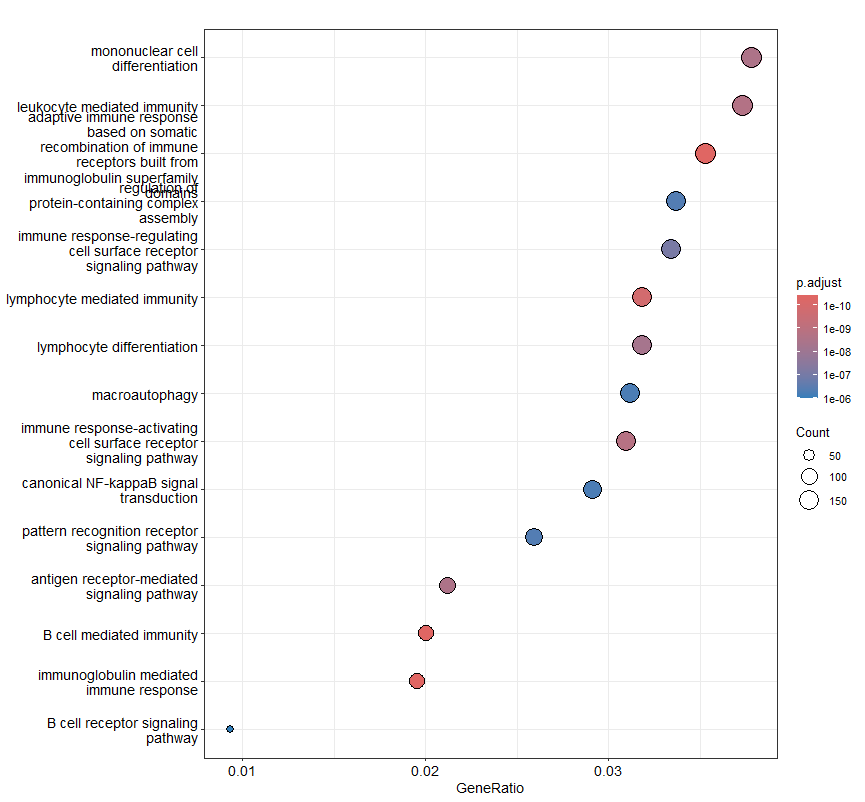

De Gene Ontology (GO) Biological Process dotplot toont de resultaten van de GO-verrijkingsanalyse op basis van de significant differentieel geëxprimeerde genen tussen RA-patiënten en gezonde controles. Het doel van deze analyse was het identificeren van biologische processen die oververtegenwoordigd zijn binnen de gevonden genexpressieveranderingen. De x-as geeft de verhouding weer tussen het aantal differentieel geëxprimeerde genen en het totale aantal genen binnen een biologisch proces (GeneRatio). De grootte van de stippen geeft het aantal betrokken genen (Count) weer, terwijl de kleur de aangepaste p-waarde (padj) van de verrijking aangeeft. De analyse liet een sterke verrijking zien van immuun- en ontstekingsgerelateerde processen, waaronder B cell mediated immunity, immunoglobulin mediated immune response, lymphocyte mediated immunity, antigen receptor-mediated signaling pathway en canonical NF-kappaB signal transduction. Daarnaast werden processen zoals lymphocyte differentiation, mononuclear cell differentiation en macroautophagy significant verrijkt. Deze resultaten wijzen op een sterke activatie van zowel de aangeboren als adaptieve immuunrespons in het synovium van patiënten met reumatoïde artritis en ondersteunen de bevindingen uit de differentiële genexpressie- en KEGG-analyses.
