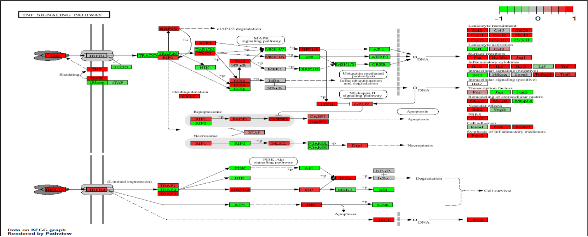

De TNF-signaalroute werd gevisualiseerd met behulp van Pathview op basis van de differentiële genexpressieresultaten van RA-patiënten ten opzichte van gezonde controles. Rood gekleurde genen zijn verhoogd tot expressie, terwijl groen gekleurde genen verlaagd tot expressie zijn in de RA-groep. Binnen deze pathway werden meerdere genen gevonden die betrokken zijn bij ontstekingsreacties, cytokineproductie, immuuncelactivatie en weefselafbraak. Daarnaast waren componenten van de NF-κB- en MAPK-signaalroutes differentieel geëxprimeerd, wat wijst op een verhoogde activatie van pro-inflammatoire signaaltransductie. De verhoogde expressie van verschillende cytokinen, chemokinen en adhesiemoleculen ondersteunt de aanwezigheid van een actieve ontstekingsrespons in het synovium van RA-patiënten. Deze bevindingen komen overeen met de KEGG-verrijkingsanalyse en bevestigen de belangrijke rol van TNF-gemedieerde signalering bij de pathogenese van reumatoïde artritis.
