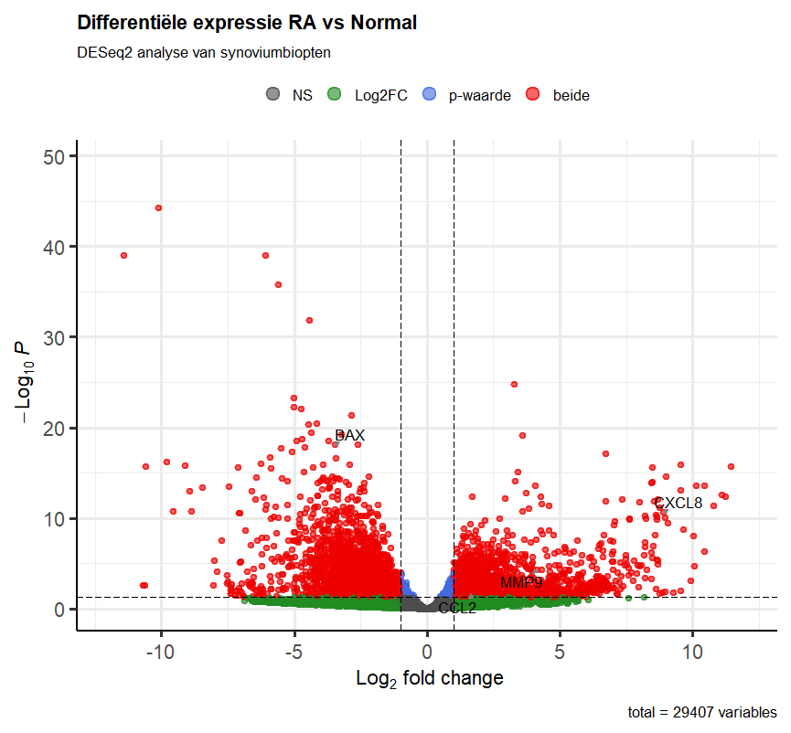

De volcano plot toont de resultaten van de DESeq2-analyse van synoviumbiopten van vier RA-patiënten en vier gezonde controles. De x-as geeft de log₂ fold change van de genexpressie weer en de y-as geeft de −log₁₀ aangepaste p-waarde weer. Rood weergegeven genen zijn significant differentieel geëxprimeerd (padj < 0,05 en |log₂FC| > 1). De gemarkeerde genen CXCL8, MMP9 en CCL2 zijn verhoogd tot expressie in RA en zijn betrokken bij ontstekingsprocessen en de rekrutering van immuuncellen. Het gen BAX is verlaagd tot expressie in RA en is betrokken bij apoptose.
